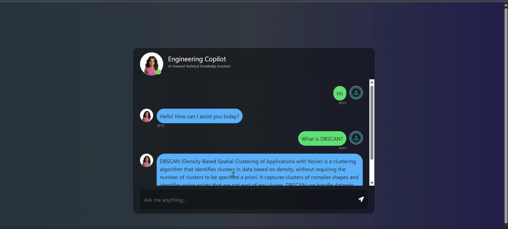
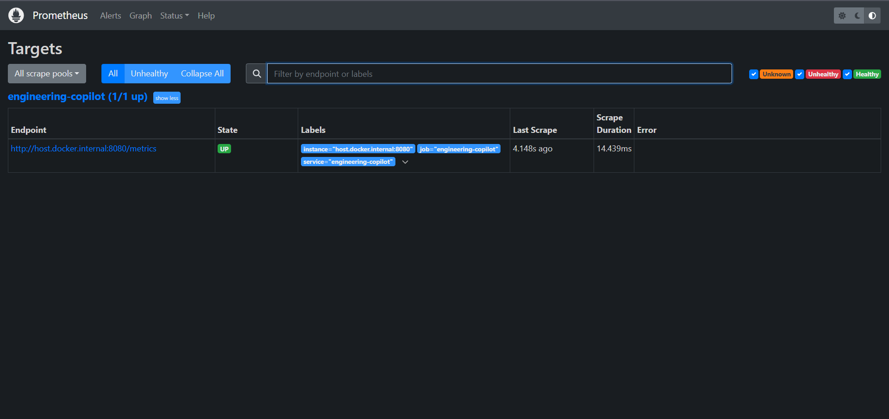

# Engineering Copilot
 
> A production-grade RAG chatbot that answers engineering questions from a curated knowledge base built with Flask, LangChain, Pinecone, and GPT-4o, deployed on AWS EC2 via Docker with full CI/CD.
 
[](https://www.python.org/)
[](https://flask.palletsprojects.com/)
[](https://python.langchain.com/)
[](https://www.pinecone.io/)
[](https://openai.com/)
[](https://www.docker.com/)
[](https://aws.amazon.com/)
[](https://github.com/features/actions)
[](./LICENSE)

## Overview
 
**Engineering Copilot** is a Retrieval-Augmented Generation (RAG) chatbot that answers engineering questions grounded in authoritative documentation not LLM hallucinations. Every response is anchored to a curated knowledge base of **1,157 pages** across 4 PDFs covering Computer Networks, DBMS, Machine Learning, and System Design.
 
The system retrieves the top-3 semantically relevant chunks per query and passes them to GPT-4o for a grounded, context-aware answer through a secure, rate-limited Flask API with session-based conversational memory, Prometheus/Grafana monitoring, and a fully automated Docker deployment pipeline to AWS EC2.

### Engineering Copilot Chat Interface



## Features

### RAG Pipeline
- Document ingestion and preprocessing
- Text chunking and embedding generation
- Semantic search using vector embeddings
- Context-aware response generation
- Engineering-focused knowledge retrieval

### Security
- JWT Authentication with Flask-JWT-Extended
- Protected API endpoints
- Environment-based credential management
- Rate limiting with Flask-Limiter (20 requests/minute)

### Monitoring & Observability
- Prometheus metrics integration
- Grafana dashboards
- Request count tracking
- API latency monitoring
- Error rate monitoring
- Requests-per-second analytics

### Testing & Quality Assurance
- Unit testing with pytest
- Integration testing
- Mocked external dependencies
- Automated testing through CI pipeline

### DevOps & Deployment
- Docker containerization
- AWS EC2 deployment
- Amazon ECR image registry
- GitHub Actions CI/CD pipeline
- Self-hosted GitHub Actions runner

## Tech Stack
 
| Layer | Technology |
|---|---|
| **Web Framework** | Flask 3.1 |
| **LLM** | OpenAI GPT-4o |
| **Orchestration** | LangChain 0.3 |
| **Vector Store** | Pinecone Serverless |
| **Embeddings** | `sentence-transformers/all-MiniLM-L6-v2` |
| **Auth** | `flask-jwt-extended` (JWT Bearer) |
| **Rate Limiting** | `Flask-Limiter` (20 req/min per IP) |
| **Session Memory** | Flask Session + custom `chat_memory` module |
| **Monitoring** | Prometheus + Grafana |
| **Testing** | pytest + pytest-mock (13 tests) |
| **Containerization** | Docker · Amazon ECR |
| **Deployment** | AWS EC2 · GitHub Actions CI/CD |

## System Architecture

```text
                    ┌───────────────┐
                    │     User      │
                    └───────┬───────┘
                            │
                            ▼
                ┌──────────────────────┐
                │ Frontend (HTML/CSS)  │
                └──────────┬───────────┘
                           │
                           ▼
                ┌──────────────────────┐
                │     Flask Server     │
                └──────────┬───────────┘
                           │
        ┌──────────────────┼──────────────────┐
        ▼                  ▼                  ▼
 ┌────────────┐    ┌──────────────┐   ┌─────────────┐
 │ JWT Auth   │    │ Rate Limiter │   │ Prometheus  │
 └────────────┘    └──────────────┘   └─────────────┘
                           │
                           ▼
                ┌──────────────────────┐
                │    LangChain RAG     │
                └──────────┬───────────┘
                           │
            ┌──────────────┼──────────────┐
            ▼                             ▼
   ┌─────────────────┐         ┌─────────────────┐
   │ Pinecone Vector │         │ OpenAI LLM API  │
   │     Database    │         │                 │
   └─────────────────┘         └─────────────────┘
                           │
                           ▼
                    Generated Answer
```

 

## Key Technical Features
 
| Feature | Detail |
|---|---|
| **RAG Pipeline** | `PineconeVectorStore` retriever → `create_stuff_documents_chain` → GPT-4o; answers grounded in source docs |
| **JWT Auth** | `/login` issues signed access token; all chat endpoints gated by `@jwt_required()` |
| **Rate Limiting** | 20 req/min per IP via `Flask-Limiter`; configurable via `CHAT_RATE_LIMIT` env var |
| **Conversational Memory** | Per-session turn history via `append_turn()` + `format_history_for_input()` |
| **Prometheus Monitoring** | `/metrics` endpoint tracking request count, latency, RPS, error rate |
| **Grafana Dashboards** | Prometheus scrape config in `prometheus.yml`; full stack via `docker-compose up` |
| **Automated Testing** | 13 pytest tests (unit + integration) run on every push in GitHub Actions |
| **CI/CD Deployment** | Push to `main` → Docker build → push to ECR → pull & restart on EC2 (self-hosted runner) |


## Installation

### Clone Repository

```bash
git clone https://github.com/Vidhisahay/Engineering-Copilot.git
cd Engineering-Copilot
```

### Create Virtual Environment

```bash
python -m venv venv
```

### Activate Environment

Windows:

```bash
venv\Scripts\activate
```

Linux/Mac:

```bash
source venv/bin/activate
```

### Install Dependencies

```bash
pip install -r requirements.txt
```


## Environment Variables

Create a `.env` file in the project root:

```env
OPENAI_API_KEY=your_openai_api_key

PINECONE_API_KEY=your_pinecone_api_key

JWT_SECRET_KEY=your_secret_key

AUTH_USERNAME=admin

AUTH_PASSWORD=password
```


## Running the Application

```bash
python app.py
```

Application will be available at:

```text
http://localhost:5000
```


## Authentication

### Login Endpoint

```http
POST /login
```

Request:

```json
{
  "username": "admin",
  "password": "password"
}
```

Response:

```json
{
  "access_token": "your_jwt_token"
}
```

### Protected Chat Endpoint

```http
POST /get
```

Header:

```text
Authorization: Bearer <jwt_token>
```


## Running Tests

```bash
pytest -v
```

Example Output:

```text
=========================
13 passed
=========================
```


## Monitoring

### Prometheus Metrics Endpoint

```text
/metrics
```

Tracked Metrics:

- Request Count
- Request Latency
- Requests Per Second
- Error Count
- API Health Status

### Prometheus Monitoring



### Grafana Dashboard

Visualizes:

- Request Volume
- Response Time
- Error Rate
- Application Performance

## Docker Deployment

### Build Docker Image

```bash
docker build -t engineering-copilot .
```

### Run Container

```bash
docker run -p 5000:5000 engineering-copilot
```


## CI/CD Pipeline

GitHub Actions automates:

1. Code Checkout
2. Dependency Installation
3. Test Execution
4. Docker Image Build
5. Push Image to Amazon ECR
6. Deploy to AWS EC2
7. Restart Application


## Future Enhancements

- Source Citations
- Multi-document Knowledge Base
- Kubernetes Deployment
- Advanced Analytics Dashboard


## Author

Made with ❤️ by Vidhi - [GitHub](https://github.com/Vidhisahay) · [LinkedIn](https://www.linkedin.com/in/vidhisahay/)